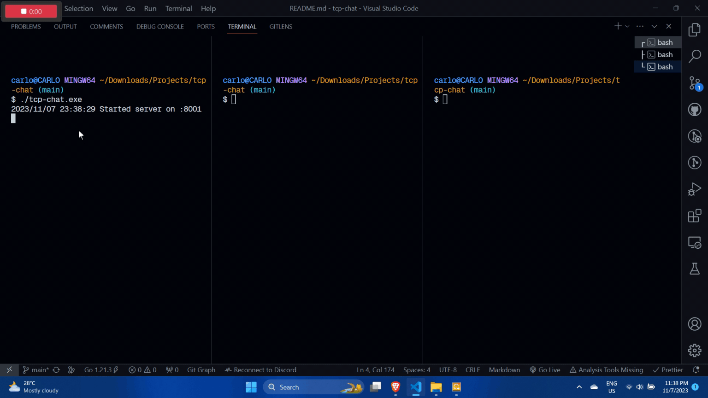

# tcp-chat

Mostly reverse-engineered from [Allen's Whistle](https://github.com/allen-tran/whistle) project.
Teaches me valuable stuff about making a tcp server (net module), parsing cli arguments, object-oriented go (making structs with variables and making methods), and pointers.

